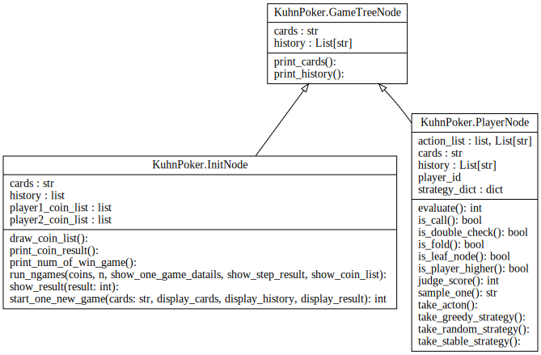
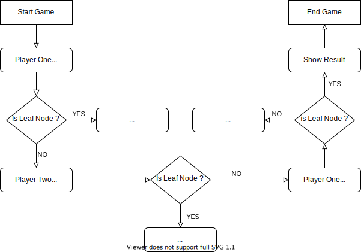

# Read Me

[说明文档中文版](ReadMeCN.md)

## Kuhn Poker

In conventional poker terms, a game of Kuhn poker proceeds as follows:

- Each player antes 1.
- Each player is dealt one of the three cards, and the third is put aside unseen.
- Player one can check or bet 1.
  - If player one **checks** then player two can check or bet 1.
    - If player two **checks** there is a showdown for the pot of 2 (i.e. the higher card wins 1 from the other player).
    - If player two bets then player one can fold or call.
      - If player one **folds** then player two takes the pot of 3 (i.e. winning 1 from player 1).
      - If player one **calls** there is a showdown for the pot of 4 (i.e. the higher card wins 2 from the other player).
  - If player one **bets** then player two can fold or call.
    - If player two **folds** then player one takes the pot of 3 (i.e. winning 1 from player 2).
    - If player two **calls** there is a showdown for the pot of 4 (i.e. the higher card wins 2 from the other player).

If you need more details, you can see [Kuhn poker's wikipedia](https://en.wikipedia.org/wiki/Kuhn_poker).

The game action flowchart is shown below, orange for player one, blue for player two and the results are bold.


## Class Design

The data structure of the game tree is constructed as follows,

- the `GameTreeNode` is the basic node, and
- we use `InitNode` to store one game infomation, while
- `PalyerNode` is used to simulated a round of player's action.



## An Easy Example



With the begin of the game, `InitNode` Node is generated and two cards are given to two players respectively.\
Firstly, `PlayerNode` is generated for player one takes actions, such as CHECK,\
After that, `PlayerNode` use `is_leaf_node()` to check if the game is over.

If the game does not stop, a new `PlayerNode` will be build for opponent player, \
and the opponent will do samething like above.

When a `PlayerNode`'s `is_leaf_node()` get a `True` result, the game ends, and the winner gains 1 coin(or 2 coins) from loser.

## Result Show

In the experiment, the details of each game are as follows. \
The first line gives the number of games played, and \
the second line deals cards to player one and Player two. \
The next two or three lines show how the game is played,
that is, what the player does. \
Then judge the game, which player won how much bet,
another player lost how much bet.\
Finally, given the game after this game,
Player one and Player two have a number of bets.

```plaintext
This is game 980.
Player one gets poker 1, player two gets poker 3.
Player one takes CHECK.
Player two takes BET.
Player one takes FOLD.
Player two wins 1 coin from player one.
Player one has 2950 coin(s), player two has 3050 coin(s).

```

## Experiment Setup

All our experiments have been performed on machines with,

- Windows 10(64 bit)
- RAM 8.00 GB
- CPU 2.70 GHz
- Anaconda(Python 3.9)
