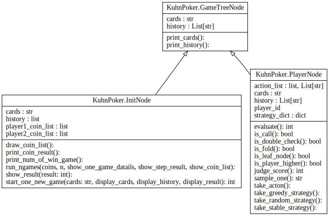
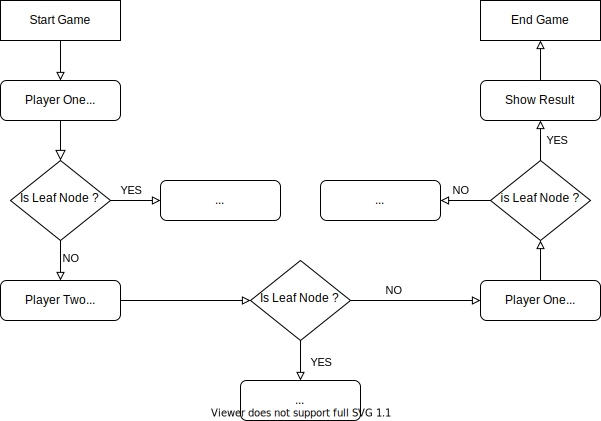

# 说明文档

[Readme(Engish version is here)](ReadMe.md)

## 库恩扑克简介

一般来说，一次库恩扑克的游戏流程如下：

- 每名玩家先押注一枚赌筹（Ante）。
- 每个玩家分发三张牌中的一张，第三张牌被放在一边，不能被看到。
- 玩家一可以选择让牌（CHECK）或是加注（BET）。
  - 如果玩家一选择**让牌**，那么玩家二可以选择让牌或加注。
    - 如果玩家二也选择**让牌**，那么两人翻牌比较大小（牌大者从对方赢取1枚赌筹）。
    - 如果玩家二选择**加注**，玩家一可以选择不跟（FOLD）或跟注（CALL）。
      - 如果玩家一**不跟**，那么玩家二拿走3枚筹码（从玩家一赢走1枚赌筹）。
      - 如果玩家一**跟注**，那么两人翻牌比较大小（牌大者从对方赢取2枚赌筹）。
  - 如果玩家一选择**加注**，那么玩家二可以选择不跟或跟注。
    - 如果玩家二**不跟**，那么玩家一拿走3枚筹码（从玩家二赢走1枚赌筹）
    - 如果玩家二**跟注**，那么两人翻牌比较大小（牌大者从对方赢取2枚赌筹）

如果你需要更详细的信息，可以参考[Kuhn poker's wikipedia](https://en.wikipedia.org/wiki/Kuhn_poker).

游戏的行动流程图如下，其中橙色是玩家一，蓝色是玩家二，结果加粗表示。



## 博弈树类结构设计

博弈树的数据结构设计如下：

- `GameTreeNode`是基础类
- `InitNode`类用来存储游戏信息
- `PalyerNode`类模拟每一轮玩家的行动信息



## 一个简单案例



游戏开始时，生成`InitNode`结点，并且把两张牌分发给玩家。\
首先，创建`PlayerNode`模拟玩家一的行动，比如过牌，\
之后调用`is_leaf_node()`方法检测游戏是否结束。

如果游戏没有结束，则创建新的`PlayerNode`结点表示对手，并向上述流程采取行动。

当一轮`is_leaf_node()`检测为真时，游戏结束，胜者从败者赢取一枚（或两枚）赌筹。

## 结果展示

在实验中，每一局的游戏详情如下，
第一行给出正在进行第几局游戏，\
第二行向玩家一和玩家二发牌。
之后的两行或三行给出游戏过程，也即玩家的操作。\
紧接着判断本局游戏，哪名玩家赢得多少赌注，另一名玩家输了多少赌注。\
最后给出本局游戏后，玩家一和玩家二各有多少赌注。

```plaintext
This is game 980.
Player one gets poker 1, player two gets poker 3.
Player one takes CHECK.
Player two takes BET.
Player one takes FOLD.
Player two wins 1 coin from player one.
Player one has 2950 coin(s), player two has 3050 coin(s).

```

## 实验环境

我们实验使用的软件和硬件信息如下：

- Windows 10(64 bit)
- RAM 8.00 GB
- CPU 2.70 GHz
- Anaconda(Python 3.9)
